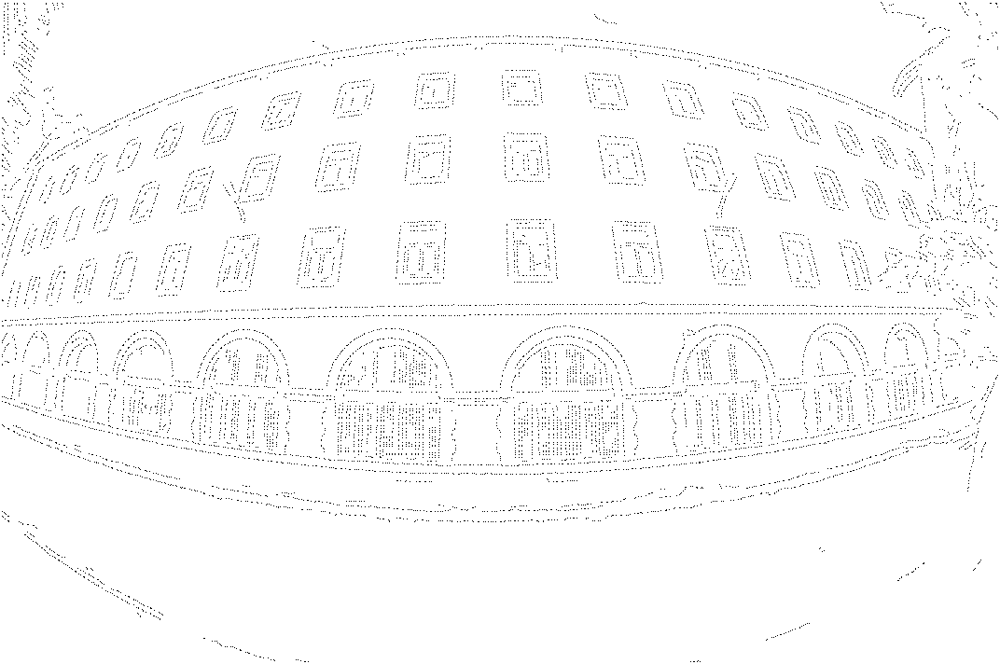
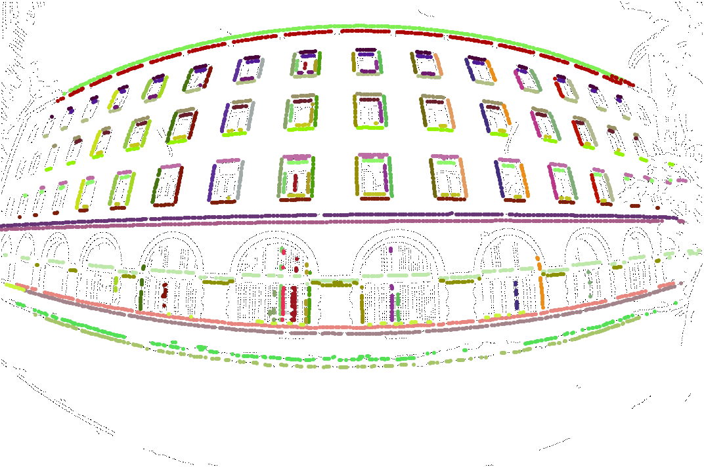

# lens-undistortion-with-automatic-method(vs2013 project)
Lens Distortion Correction Using Two-Parameter Models, polynomial and division models.
This method aimed at correct the len's radial distortion. Use the method, you can correcte the distortion image without camera calibration.

The source code provides an implementation of a lens distortion correction algorithm and algorithm as described in IPOL. The undistortion IPOL website is http://www.ipol.im/pub/art/2016/130/?utm_source=doi. The source code and articles was download from IPOL website.

# Dependencies
* libpng header and libraries
* zlib header and libraries

since the source code need the libpng, so I combine the undistortion code to libpng solution with ldm_pq2p_io project.
The source code path:lens-undistortion-with-automatic-method\lpng1636\ldm_pq2p_io

# Result
**Source picture**

**Results of Canny Edge Detector**

**The estimated distorted lines**

**Result picture**

# Models parameters
In the path:lpng1636\projects\vstudio\ldm_pq2p_io\example\primitives.txt
